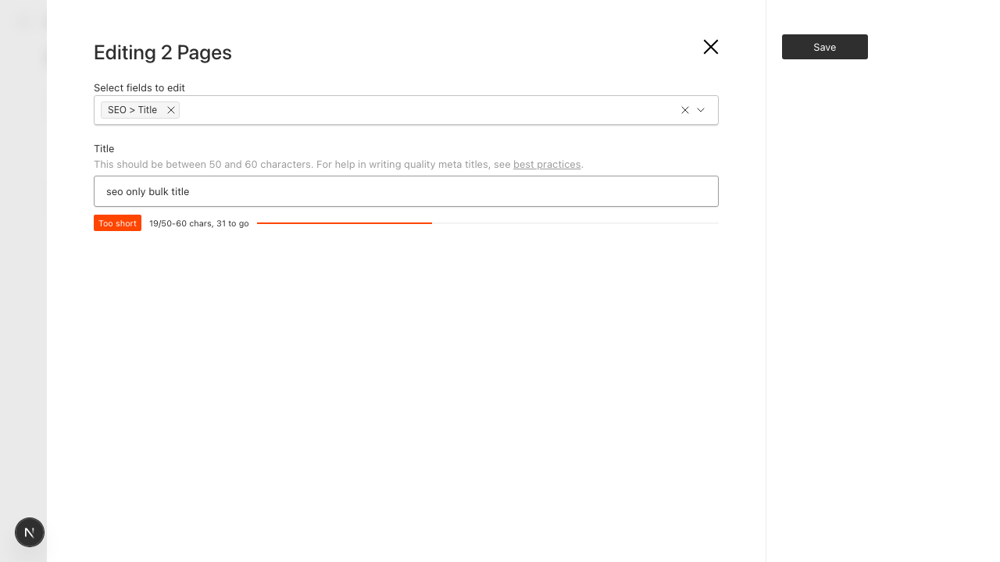

# bulk-edit-drops-custom-field-values

Reproduction for a Payload CMS v3 bug: in the **bulk edit ("Edit") drawer** of the list view, any
field rendered by a **custom field component** silently loses its value. The drawer reports success,
a new `updatedAt` is written, and the field is unchanged.

`@payloadcms/plugin-seo` is affected out of the box — its `meta.title`, `meta.description` and
`meta.image` fields are all custom components — which makes SEO metadata impossible to bulk edit.

## Why it happens

`EditMany/DrawerContent.tsx` renders each selected field by calling `RenderField` directly instead of
going through `RenderFields`. Only `RenderFields` wraps fields in a `FieldPathContext` provider, and
`RenderField` short-circuits custom components (`if (CustomField !== undefined) return CustomField`)
without passing its `path` prop to them. A custom component that calls `useField()` therefore resolves
`path` to `undefined`, `setValue` writes to the form-state key `undefined`, and on submit the value is
sent as a top-level `"undefined"` property that the server discards.

## Running it

```bash
pnpm install
cp .env.example .env
pnpm dev
```

Log in at http://localhost:3000/admin with `dev@example.com` / `test`. Two pages are seeded on first
start.

## Steps to reproduce

1. Go to **Collections → Pages**.
2. Tick the select-all checkbox, then press **Edit**.
3. In "Select fields to edit", choose **SEO > Title** (or **Custom Text**, a plain custom component
   included here to show the bug is not plugin-specific).
4. Type any value and press **Save**.

**Expected**: `meta.title` is updated on both pages.

**Actual**: the toast says "2 Pages successfully updated", but `meta.title` is unchanged. The rendered
input's id is `field-undefined`, and the PATCH body is:

```json
{ "undefined": "seo only bulk title", "meta": {} }
```


